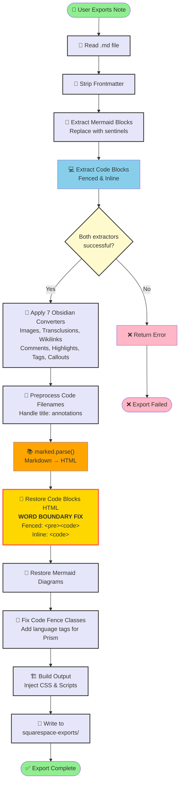

# obs-note-to-snippet

An Obsidian plugin that converts a note into a Squarespace-ready HTML snippet, pasted directly into a Squarespace Code Block.

## What it does

- Strips frontmatter and converts Markdown to HTML via `marked`
- Handles Obsidian-specific syntax: wikilinks, highlights, comments, tags, callouts, transclusions
- Wraps code blocks with Prism.js classes for syntax highlighting
- Extracts Mermaid diagrams and preserves them for rendering
- Optionally embeds a CSS block for styling code blocks, callouts and Mermaid diagrams
- Outputs a self-contained HTML snippet (no `<!DOCTYPE>`, no `<head>`) ready to paste into Squarespace

## Plugin Pipeline

The plugin uses a **sentinel-based pattern** to safely extract code blocks, process markdown, and restore code with proper HTML tags. See [SENTINEL_PATTERN.md](./SENTINEL_PATTERN.md) for technical details.

```text
User Export → Read File → Strip Frontmatter
  ↓
Extract Mermaid & Code Blocks (replace with sentinels)
  ↓
Apply Obsidian Converters (images, wikilinks, etc.)
  ↓
Parse Markdown to HTML (marked.js)
  ↓
Restore Code Blocks HTML (with word boundary fix)
  ↓
Restore Mermaid Diagrams → Fix Classes → Build Output
  ↓
Write HTML to squarespace-exports/
```

### Detailed Flow Diagram



## Note

This is a personal project built for my own workflow and published as an example. It is not actively developed or maintained, and is not listed in the Obsidian community plugin directory. Feel free to fork and adapt it for your own use.

## Usage

1. Open a note in Obsidian
2. Run the command **Export note to HTML snippet** (or click the ribbon icon)
3. The exported `.html` file is saved to the folder set in plugin settings (default: `squarespace-exports`)

## Setup

- Clone the repo
- `npm i` to install dependencies
- `npm run dev` to build in watch mode (output goes to your vault's plugin folder — update `PLUGIN_DIR` in `esbuild.config.mjs` to match your vault path)

## Squarespace one-time setup

Add the following to **Pages → Custom Code → Code Injection**:

**Header** — Prism stylesheet:

```html
<link rel="stylesheet" href="https://cdnjs.cloudflare.com/ajax/libs/prism/1.29.0/themes/prism-tomorrow.min.css">
```

**Footer** — Prism scripts (and Mermaid scripts if you use diagrams):

```html
<script src="https://cdnjs.cloudflare.com/ajax/libs/prism/1.29.0/prism.min.js"></script>
<script src="https://cdnjs.cloudflare.com/ajax/libs/prism/1.29.0/plugins/autoloader/prism-autoloader.min.js"></script>
```

## Licence

MIT
